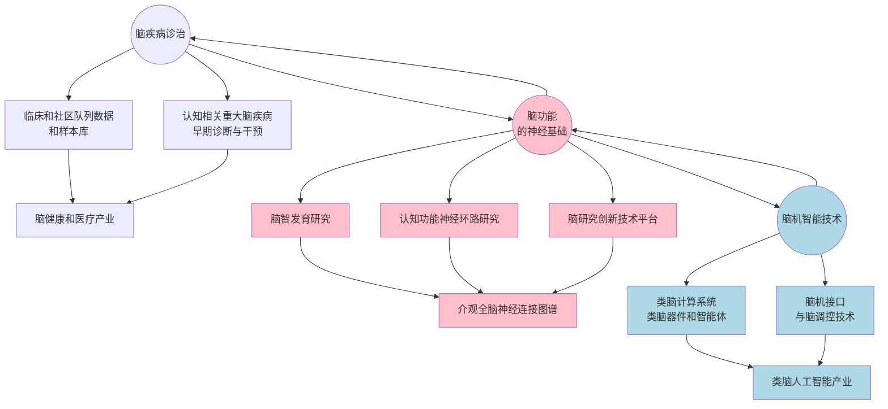
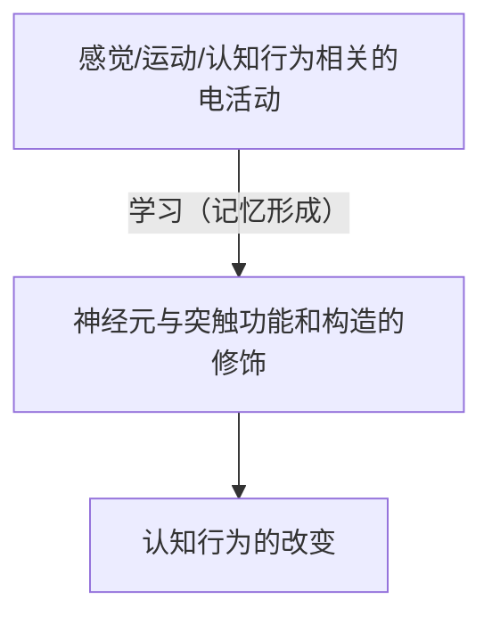

## 脑科学目前发展的「一体两翼」模型

脑科学使用的各种模式动物：线虫 --> 斑马鱼 --> 果蝇 --> 小鼠 --> 猕猴 --> 人类

大脑结构：人类大脑之所以复杂，主要在于大脑皮层，其余的部分属于进化时的保守部分。

## 内容

### 大脑的神经网络

由近千亿神经细胞通过百万亿个突触联结组成神经网络，以特殊神经环路（回路）实现感知、运动、思维等功能。

### 可塑性是大脑最重要的特性

- 学习：神经网络处理和储存信息的过程；
- 记忆：储存在神经网络内可提取的信息。

### 赫伯学习法则

1. 同步的电活动可造成突触加强或稳固；
2. 不同步电活动可造成突触削弱或消失。

> 一起放电的神经元连接在一起。

- LTP-突触功能长期强化——>树突棘变大——>影响树突权重增强
- LTD-突触功能长期弱化——>树突棘变小——>影响树突权重减弱

### 人的聪明才智来自何处？

- 大脑的功能来自神经网络，而出生后的环境和经验引起的电活动是塑造网络的主要因素。
- 各种功能的网络形成在出生后都有一个关键期（如视觉系统1-3岁，语言系统2-7岁），关键期内电活动可以稳固或修剪神经连接，塑造出成熟的神经网络。
- 有限的网络可塑性在网络形成后还一直存在；这些可塑性也就是成熟大脑的记忆学习等各种认知功能的基础。
- 遗传基因是建立正常网络的必要条件，但形成不同网络（脑功能的基础）的因素来自后天不同经验。

### 图灵的「儿童机器」（child machine）

> 图灵：“与其尝试开发一个模拟成人大脑的算法程序，为什么不去模拟一个儿童的大脑？然后通过合适的教育过程，我们就可以获得大脑的功能。”

### 大脑认知的关键问题

信息捆绑问题（The binding problem）—各种信息如何组合为整体的感知？

**聚合模型**（convergence model）：感知=对各组合成分有反应的神经元的输出聚合到一个负责感知的神经元。

**同步放电模型**（correlated firing model）：感知=对各组合成分有反应的神经元的同步放电。

> 赫伯细胞群假说（Hebb's cell assembly hypothesis）
>
> - 同步电活动强化了细胞群之间突触连接 ——> 感知记忆的存储
> - 储存记忆的细胞群再次被启动 ——> 感知记忆的提取

### 「祖母」概念的形成和记忆

假说：

1. 代表概念各成分的神经元集群分布在各脑区；
2. 概念的形成：各集群间同步放电造成长程环路连接的强化；
3. 概念的提取：部分集群的放电引起整个概念集群的激活。

### 「新图灵测试」的建议

**语言与感知觉能力的整合**：要求机器人和一个真人各自操作一支机械手合作玩一个游戏，同时要求他对彼此的动作进行对话。与原版图灵测试一样，裁判需要区分机器人与真人。

**团队合作**：要求机器人参加一个团队，机器人需要能理解团队成员的喜好、分享信息、对不确定性的环境有对策（如参加打篮球或讨论会），裁判需要区分机器人与其他团队成员。