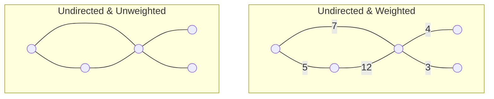
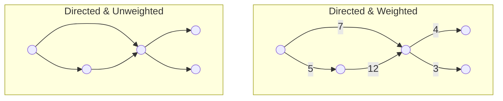
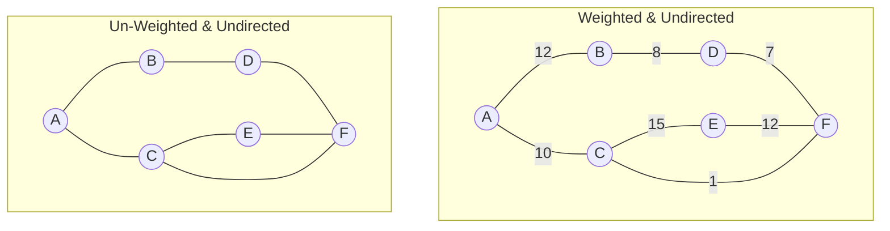
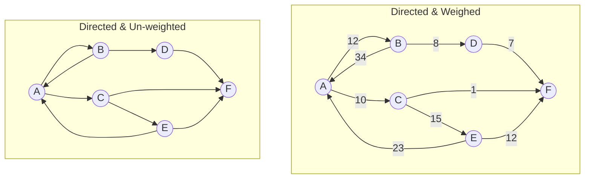

## 图数据结构

任何图都由若干个节点（vertices or nodes）以及若干个边（edges）组成，所以图可以被存储为节点集合和边集合。由于图的边可以是有向的也可以是无向的，所以图也分为有向图和无向图；根据图的边是否有权值，图也可以分为有权图和无权图。当图的边只有权值（weights）这一个信息时，权值就代表边存储的全部信息，当图的边承载的信息更复杂时，一般要想办法将其转化为向量的形式。

<!--more-->

> 一个全连接图意味着如果是无向图则图中所有的节点之间都有一个边连接。如果是有向图，则总是存在一个边，这个边的两头为任意节点。

## 图的数学表示

<table>
<tr><th>无向 & 无权图 （Un-Weighted & Undirected Graph）</th><th>无向 & 有权图 （Weighted & Undirected Graph）</th></tr>
<tr><td>

| 节点的集合                                    | 边的集合                                                     | 边的集合（另一种格式）                                       |
| --------------------------------------------- | ------------------------------------------------------------ | ------------------------------------------------------------ |
| $V=\{$ $A, B, $ $C, D, $ $E, F\}$ | $E=\{$ $AB, AC,$  $BD, CE,$  $CF, DF,$  $EF\}$ | $E=\{$ $(A,B),(A,C),$  $(B,D),(C,E),$  $(C,F),(D,F),$  $(E,F)\}$ |

</td><td>

|b|1|2|3| 
|--|--|--|--|
|a|s|d|f|

</td></tr> </table>

|      |      |
| ---- | ---- |

| 节点的集合： $V=\{A, B, C, D, E, F\}$                     | 节点的集合： $V=\{A, B, C, D, E, F\}$                     |
| ------------------------------------------------------------ | ------------------------------------------------------------ |
| **边的集合：** $E=\{AB, AC, BD, CE, CF, DF, EF\}$ $E=\{(A,B), (A,C), (B,D), (C,E),$  $(C,F), (D,F), (E,F)\}$ | **边的集合：** $E=\{AB, AC, BD, CE, CF, DF, EF\}$ $E=\{(A,B,12), (A,C,10), (B,D,8),$ $ (C,E,15), (C,F,1), (D,F,7), (E,F,12)\}$ |

邻居（Neighbors）：有边相连的两个节点互为邻居。例：B 和 C 是 A 的所有邻居。

### 边列表（Edge list）

| 有向 & 无权图 （Directed & Un-weighted） | 有向 & 有权图 （Directed & Weighed） |
| -------------------- | ------------------------ |
|<占位符>|<占位符>|

| Node1 | Node2 |<占位符>| Node1 | Node2 |Weight|
| ----- | ----- |-------| ----- | ----- | ------ |
|   A   |   B   |<占位符>|   A   |   B   |   12   |
|   A   |   C   |<占位符>|   A   |   C   |   10   |
|   B   |   D   |<占位符>|   B   |   D   |   8   |
|   C   |   E   |<占位符>|   C   |   E   |   15   |
|   C   |   F   |<占位符>|   C   |   F   |   1   |
|   D   |   F   |<占位符>|   D   |   F   |   7   |
|   E   |   F   |<占位符>|   E   |   F   |   12   |
|   E   |   A   |<占位符>|   E   |   A   |   23   |
|   B   |   A   |<占位符>|   B   |   A   |   34   |
