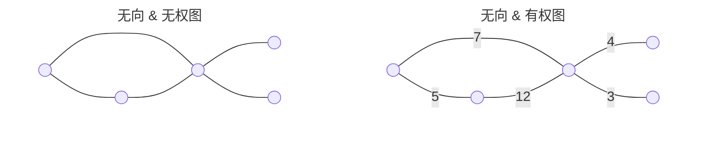
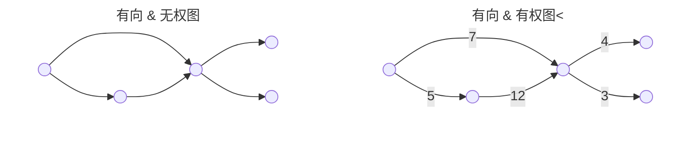
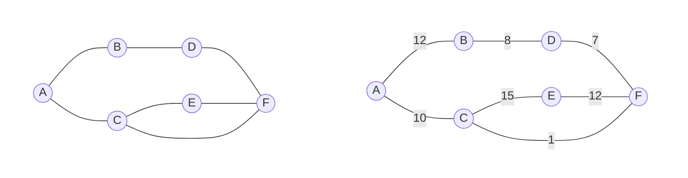
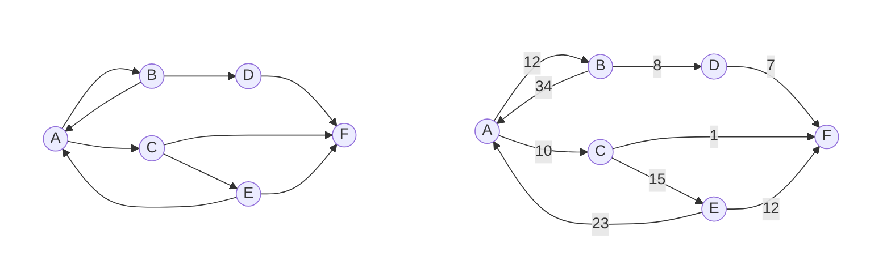
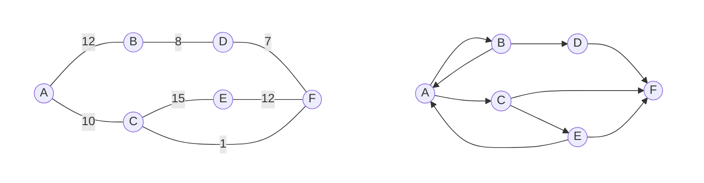
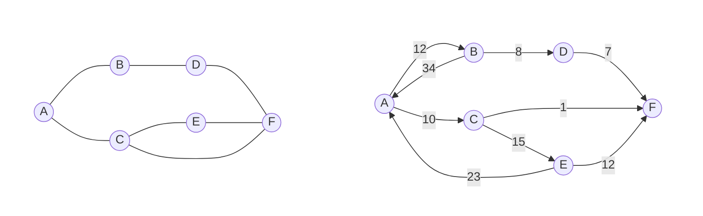
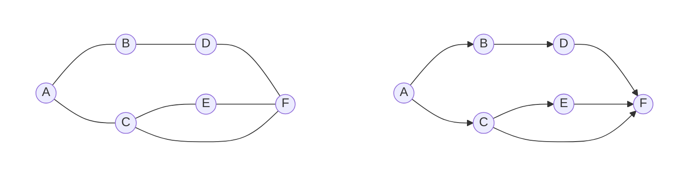
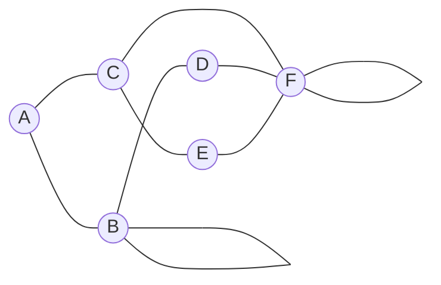

## 图数据结构

任何图都由若干个节点（vertices or nodes）以及若干个边（edges）组成，所以图可以被存储为节点集合和边集合。由于图的边可以是有向的也可以是无向的，所以图也分为有向图和无向图；根据图的边是否有权值，图也可以分为有权图和无权图。当图的边只有权值（weights）这一个信息时，权值就代表边存储的全部信息，当图的边承载的信息更复杂时，一般要想办法将其转化为向量的形式。

<!--more-->

> 一个全连接图意味着如果是无向图则图中所有的节点之间都有一个边连接。如果是有向图，则总是存在一个边，这个边的两头为任意节点。

## 图的数学表示

| 无向 & 无权图 （左图，Un-Weighted & Undirected Graph）   | 无向 & 有权图 （右图，Weighted & Undirected Graph）      |
| ------------------------------------------------------------ | ------------------------------------------------------------ |
| {::nomarkdown}<table>  <tr>    <th>节点的集合</th>    <th>边的集合</th>    </tr>  <tr>    <td>V={A,B,C,D,E,F}</td>  <td>E={(A,B),(A,C),(B,D),(C,E),(C,F),(D,F),(E,F)}</td>  </tr>  </table>{:/} | {::nomarkdown}<table>  <tr>    <th>节点的集合</th>    <th>边的集合</th>  </tr>  <tr>    <td>V={A,B,C,D,E,F}</td>  <td>E={(A,B,12), (A,C,10), (B,D,8), (C,E,15), (C,F,1), (D,F,7), (E,F,12)}</td>  </tr>  </table>{:/} |

邻居（Neighbors）：有边相连的两个节点互为邻居。例：B 和 C 是 A 的所有邻居。

### 边列表（Edge list）

| 有向 & 无权图 （左图，Directed & Un-weighted）            | 有向 & 有权图 （右图，Directed & Weighed）               |
| ------------------------------------------------------------ | ------------------------------------------------------------ |
| {::nomarkdown}<table>  <tr>    <th>Node1</th>    <th>Node2</th>    </tr>  <tr>  <td>A</td>  <td>B</td>  </tr>  <tr>  <td>A</td>  <td>C</td>  </tr>  <tr>  <td>B</td>  <td>D</td>  </tr>  <tr>  <td>C</td>  <td>E</td>  </tr>  <tr>  <td>C</td>  <td>F</td>  </tr>  <tr>  <td>D</td>  <td>F</td>  </tr>  <tr>  <td>E</td>  <td>F</td>  </tr>  <tr>  <td>E</td>  <td>A</td>  </tr>  <tr>  <td>B</td>  <td>A</td>  </tr>  </table>{:/} | {::nomarkdown}<table>  <tr>    <th>Node1</th>    <th>Node2</th>    <th>Weight</th>    </tr>  <tr>  <td>A</td>  <td>B</td>  <td>12</td>  </tr>  <tr>  <td>A</td>  <td>C</td>  <td>10</td>  </tr>  <tr>  <td>B</td>  <td>D</td>  <td>8</td>  </tr>  <tr>  <td>C</td>  <td>E</td>  <td>15</td>  </tr>  <tr>  <td>C</td>  <td>F</td>  <td>1</td>  </tr>  <tr>  <td>D</td>  <td>F</td>  <td>7</td>  </tr>  <tr>  <td>E</td>  <td>F</td>  <td>12</td>  </tr>  <tr>  <td>E</td>  <td>A</td>  <td>23</td>  </tr>  <tr>  <td>B</td>  <td>A</td>  <td>34</td>  </tr>  </table>{:/} |

### 邻接矩阵（Adjacency matrix）

- 邻接矩阵是一个 2D 正方形矩阵；
- 每一个节点都占据两个维度的一个刻度；
- 无权图则矩阵值一般为 True/False 或 1/0；
- 权图则为权值，无权边可以为 -1。

一般表示为：$A=N\times N$

| 无向 & 有权图（左图）                                        | 有向 & 无权图（右图）                                        |
| ------------------------------------------------------------ | ------------------------------------------------------------ |
| $\begin{matrix} \  & \rm A & \rm B & \rm C & \rm D & \rm E & \rm F \\\\ \rm A & -1 & 12 & 10 & -1 & -1 & -1\\\\ \rm B & -1 & -1 & -1 & 8 & -1 & -1 \\\\ \rm C & -1 & -1 & -1 & -1 & 15 & 1\\\\ \rm D & -1 & -1 & -1 & -1 & -1 & 7\\\\ \rm E & -1 & -1 & -1 & -1 & -1 & 12\\\\ \rm F & -1 & -1 & -1 & -1 & -1 & -1\\\\ \end{matrix}$ | $\begin{matrix} \  & \rm A & \rm B & \rm C & \rm D & \rm E & \rm F \\\\ \rm A & F & T & T & F & F & F\\\\ \rm B & T & F & F & T & F & F \\\\ \rm C & F & F & F & F & T & T\\\\ \rm D & F & F & F & F & F & T\\\\ \rm E & T & F & F & F & F & T\\\\ \rm F & F & F & F & F & F & F\\\\ \end{matrix}$ |

> 严格意义上无向图的邻接矩阵应该是对称矩阵，但是有些时候为了方便存储或是其他原因，可能会表示为三角矩阵。

| 无向 & 无权图（左图）                                        | 有向 & 有权图（右图）                                        |
| ------------------------------------------------------------ | ------------------------------------------------------------ |
| $\begin{matrix} \  & \rm A & \rm B & \rm C & \rm D & \rm E & \rm F \\\\ \rm A & F & T & T & F & F & F\\\\ \rm B & F & F & F & T & F & F \\\\ \rm C & F & F & F & F & T & T\\\\ \rm D & F & F & F & F & F & T\\\\ \rm E & F & F & F & F & F & T\\\\ \rm F & F & F & F & F & F & F\\\\ \end{matrix}$ | $\begin{matrix} \  & \rm A & \rm B & \rm C & \rm D & \rm E & \rm F \\\\ \rm A & -1 & 12 & 10 & -1 & -1 & -1\\\\ \rm B & 34 & -1 & -1 & 8 & -1 & -1 \\\\ \rm C & -1 & -1 & -1 & -1 & 15 & 1\\\\ \rm D & -1 & -1 & -1 & -1 & -1 & 7\\\\ \rm E & 23 & -1 & -1 & -1 & -1 & 12\\\\ \rm F & -1 & -1 & -1 & -1 & -1 & -1\\\\ \end{matrix}$ |

### 关联矩阵（Incidence matrix）

| 无向图（左图）                                               | 有向图（右图）                                               |
| ------------------------------------------------------------ | ------------------------------------------------------------ |
| $\begin{matrix} \  & \rm e1 & \rm e2 & \rm e3 & \rm e4 & \rm e5 & \rm e6 & \rm e7 \\\\ \rm A & 1 & 1 & 0 & 0 & 0 & 0 & 0\\\\ \rm B & 1 & 0 & 0 & 0 & 0 & 1 & 0\\\\ \rm C & 0 & 1 & 1 & 0 & 1 & 0 & 0\\\\ \rm D & 0 & 0 & 0 & 0 & 0 & 1 & 1\\\\ \rm E & 0 & 0 & 1 & 1 & 0 & 0 & 0\\\\ \rm F & 0 & 0 & 0 & 1 & 1 & 0 & 1\\\\ \end{matrix}$ | $\begin{matrix} \  & \rm e1 & \rm e2 & \rm e3 & \rm e4 & \rm e5 & \rm e6 & \rm e7 \\\\ \rm A & -1 & -1 & 0 & 0 & 0 & 0 & 0\\\\ \rm B & 1 & 0 & 0 & 0 & 0 & -1 & 0\\\\ \rm C & 0 & 1 & -1 & 0 & -1 & 0 & 0\\\\ \rm D & 0 & 0 & 0 & 0 & 0 & 1 & -1\\\\ \rm E & 0 & 0 & 1 & -1 & 0 & 0 & 0\\\\ \rm F & 0 & 0 & 0 & 1 & 1 & 0 & 1\\\\ \end{matrix}$ |
| 如果节点和边相连，则值为 1，否则为 0。节点由行表示，而边相反。 | 如果节点和边相连，根据边的方向，值取 -1/1，不相连则取 0。节点由行表示，而边相反。 |

### 度矩阵（Degree Matrix）

如果不区分入度和出度的话，任意有向图的度矩阵和将它的边的方向删掉得到的无向图的度矩阵是一样的。

$\begin{matrix} \  & \rm A & \rm B & \rm C & \rm D & \rm E & \rm F \\\\ \rm A & 2 & 0 & 0 & 0 & 0 & 0\\\\ \rm B & 0 & 4 & 0 & 0 & 0 & 0 \\\\ \rm C & 0 & 0 & 3 & 0 & 0 & 0\\\\ \rm D & 0 & 0 & 0 & 2 & 0 & 0\\\\ \rm E & 0 & 0 & 0 & 0 & 2 & 0\\\\ \rm F & 0 & 0 & 0 & 0 & 0 & 5\\\\ \end{matrix}$

> 度矩阵是一个对角矩阵。

### 拉普拉斯矩阵（Laplacian Matrix）

- 测量矩阵的平滑性；
- $L=Degree Matrix - Adjacency Matrix$
- $L=\{D-A\}$

$D(Degree\ Matrix):$

$\begin{matrix} \  & \rm A & \rm B & \rm C & \rm D & \rm E & \rm F \\\\ \rm A & 2 & 0 & 0 & 0 & 0 & 0\\\\ \rm B & 0 & 4 & 0 & 0 & 0 & 0 \\\\ \rm C & 0 & 0 & 3 & 0 & 0 & 0\\\\ \rm D & 0 & 0 & 0 & 2 & 0 & 0\\\\ \rm E & 0 & 0 & 0 & 0 & 2 & 0\\\\ \rm F & 0 & 0 & 0 & 0 & 0 & 5\\\\ \end{matrix}$

$A(Adjacency\ Matrix):$ (自连这里算作两条边)

$\begin{matrix} \  & \rm A & \rm B & \rm C & \rm D & \rm E & \rm F \\\\ \rm A & 0 & 1 & 1 & 0 & 0 & 0\\\\ \rm B & 1 & 2 & 0 & 1 & 0 & 0 \\\\ \rm C & 1 & 0 & 0 & 0 & 1 & 1\\\\ \rm D & 0 & 1 & 0 & 0 & 0 & 1\\\\ \rm E & 0 & 0 & 1 & 0 & 0 & 1\\\\ \rm F & 0 & 0 & 1 & 1 & 1 & 2\\\\ \end{matrix}$

$L=\{D-A\}:$

$\begin{matrix} \  & \rm A & \rm B & \rm C & \rm D & \rm E & \rm F \\\\ \rm A & 2 & -1 & -1 & 0 & 0 & 0\\\\ \rm B & -1 & 2 & 0 & -1 & 0 & 0 \\\\ \rm C & -1 & 0 & 3 & 0 & -1 & -1\\\\ \rm D & 0 & -1 & 0 & 2 & 0 & -1\\\\ \rm E & 0 & 0 & -1 & 0 & 2 & -1\\\\ \rm F & 0 & 0 & -1 & -1 & -1 & 3\\\\ \end{matrix}$

## 图神经网络（Graph Neural Network or GNN）

- 一种可以对图数据结构应用的神经网络；
- GNN 通常可以提供以下单位上的分类/预测任务：
  - 节点级别
  - 边级别
  - 图级别
- 主要分类：
  - Recurrent GNN
  - Spatial Convolutional Network
  - Spectral Convolutional Network
- GNN 能够帮助我们：
  - 分类节点
  - 预测 边/连接
  - 分类图

### GNN 数据模式（Batch vs Single Mode）

**Single Mode:** 包含大量节点的单个图

**Batch Mode:** 包含一个或多个节点的图集合